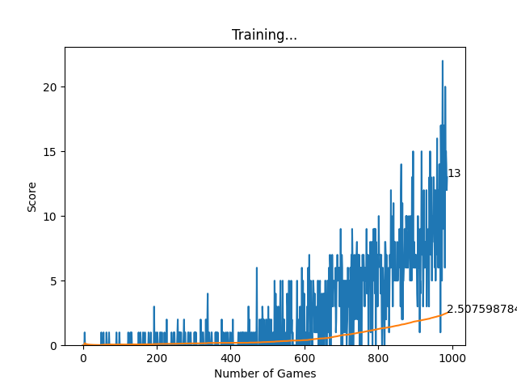

Python Version : 3.10.4

 ipython == 8.4.0 
 matplotlib == 3.5.2 
 matplotlib-inline == 0.1.3 
 numpy == 1.22.4 
 pip == 22.1.2 
 pygame == 2.1.2 
 torch == 1.11.0+cpu 
 torchvision == 0.12.0+cpu 

## Project Description:
In this project I created snake game from scratch in which I tried to implement AI Learning. This repository contains two files which can be executed are <b><i>play.py</i></b> which runs the normal snake game where the user can play it and <b><i>run.py</b></i> which are present in folders <b>'Normal Game'</b> and <b>'AI Game'</b> respectively.
For training the AI referenced the youtube playlist named . The difference from the project done in that video and this one is that the game is created by me which makes the process execution unique.
The AI network is made up of an input layer of 11 values, hidden layer of 256 values and an output layer of 3 values. The input layer which is the state of the snake's head. The first three values of this depicts the danger of an action, the next four values represent which direction the snake is travelling in and last four values depict where the food is in reference to snake's head. The networks output consist of 3 values which represent whether the snake should continue moving forward, take a right turn or take a left turn respectively. To counter the exploration-exploitation deliema we are using epsilon-greedy policy with epsilon decreasing after each game played. We are also restricting the gameplay of the agent till it crashes or it exceed a certain number of steps which is calculated dynamically.
We notice that at first the agent is very bad at moving as it is taking many rnadom steps due to high epsilon value but AI becomes smart and as the number of random actions are dropping with each game so its average score starts increasing. I ran the program till it reached ~1000 Games and in those games it reached the highest score of 22.

<!--  -->
The above graph represents how the mean score and current score are changing throughout the gameplay.
